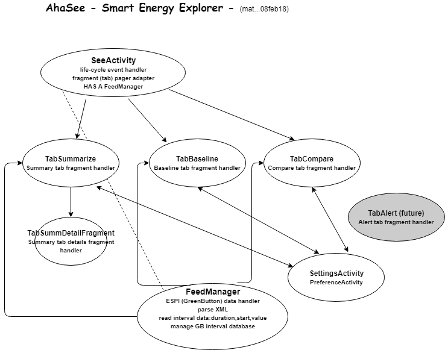

# AhaSee
AhaSee (aka Smart Energy Explorer in the PlayStore) enables visualization of energy usage patterns based on SmartMeter GreenButton data.

Features: 
- SmartMeter GreenButton XML parser
- Android Chart Engine based graphs, charts, visualizations

For PlayStore listing please see https://play.google.com/store/apps/details?id=com.adaptivehandyapps.ahasee

